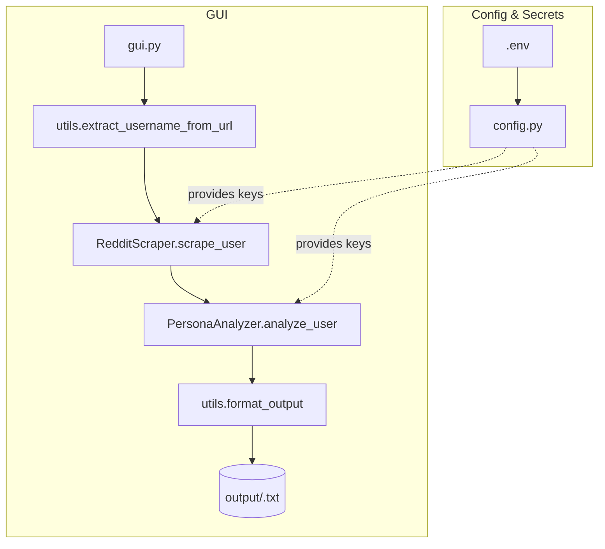

# Reddit Persona Analyzer 

A lightweight **CLI** tool that converts scraped Reddit posts/comments into a structured **persona JSON** using the OpenAI Chat Completion API.

> **Use case** – Quickly derive marketing personas, sociological profiles, or user insights from raw Reddit data.

---

## 1  Features

* Minimal dependencies (`openai` only).
* PEP 8‑compliant codebase, formatted with `black`, linted with `ruff` (88‑char lines).
* Works with **single** or **multiple** text files.
* Excerpt & citation caps keep prompts short (80 chars/excerpt, 3 citations/trait – configurable).
* Clear error handling for missing files or malformed OpenAI responses.

---

## 2  Repository Layout & Execution Flow

|  Order  |  File / Folder     |  Role in the Application                                                                                                                    |  When It Runs                        |
| ------: | ------------------ | ------------------------------------------------------------------------------------------------------------------------------------------- | ------------------------------------ |
|       1 | `.env`             | Stores **all secrets** – OpenAI key, Reddit credentials, etc. Read by `config.py` via `python‑dotenv`.                                      |  Startup ( import‑time)              |
|       2 | `config.py`        | Central configuration module. Loads `.env`, validates keys, exposes constants (`OPENAI_API_KEY`, `REDDIT_CLIENT_ID`, …).                    | Imported by **every** runtime script |
|       3 | `requirements.txt` | Exact Python dependencies (`openai`, `praw`, `python‑dotenv`, `tkinter` for Windows, etc.).                                                 | Installation time                    |
|       4 | `gui.py`           | **Tkinter GUI entry‑point**. Handles user input (Reddit URL), spawns background thread, shows progress bar, and saves/opens analysis files. | `python gui.py`                      |
|       5 | `src/`             | Core package containing reusable business logic:                                                                                            | Imported by `gui.py`                 |
|       → | `__init__.py`      | Makes `src` a Python package.                                                                                                               |  —                                   |
|       → | `scraper.py`       | `RedditScraper` class – connects to Reddit via **PRAW**, fetches posts & comments, returns `user_data` dict.                                | Called during an analysis run        |
|       → | `analyzer.py`      | `PersonaAnalyzer` class – sends user data to **OpenAI** and builds structured persona insights.                                             | Called after scraping                |
|       → | `utils.py`         | Helper functions: `extract_username_from_url()`, `format_output()`, `sanitize_filename()`.                                                  | Utility imports                      |
|       6 | `output/`          | Target directory for saved analyses (`<username>.txt`). **Git‑ignored**.                                                                    | Runtime write                        |
|       7 | `README.md`        | Project documentation (what you’re reading).                                                                                                |  —                                   |

### High‑level Flow



All execution paths start with **`gui.py`**, which orchestrates scraping (via `scraper.py`) and analysis (via `analyzer.py`). Configuration and secrets are centralised in `config.py`, which reads from the `.env` file.

---

## 3  Prerequisites

| Requirement    | Version | Reason                                                |
| -------------- | ------- | ----------------------------------------------------- |
| Python         | ≥ 3.8   | `pathlib` typing + TLS features demanded by `openai`. |
| OpenAI API key | any     | Needed to call Chat Completion (`gpt‑4o`).            |

---

## 4  Installation

```bash
# Clone (or download ZIP)
$ git clone https://github.com/<you>/reddit-persona-analyzer.git
$ cd reddit-persona-analyzer/persona_project

# Virtual environment
$ python -m venv .venv
$ source .venv/bin/activate            # Windows: .venv\Scripts\Activate.ps1

# Dependencies
$ pip install -r requirements.txt

# Add your OpenAI key
$ cp config_example.py config.py       # edit config.py with your own api key  -> OPENAI_API_KEY = "sk-..."
```

---

### 5 CLI Usage

```bash
usage: main.py [-h] [-o OUT] [-v] url
```

Analyze Reddit user profiles and generate persona text reports.

**positional arguments**

* `url`
  Reddit user profile URL (e.g., `https://www.reddit.com/user/username/`)

**optional arguments**

* `-h`, `--help`
  Show this help message and exit
* `-o OUT`, `--output OUT`
  Output file path (default: `output/<username>.txt`)
* `-v`, `--verbose`
  Enable verbose mode (prints stats and a preview of the persona)

**Examples**

Analyze a single Reddit user:

```bash
python main.py https://www.reddit.com/user/sample_user/ -o output/sample_user.txt
```

Enable verbose output:

```bash
python main.py https://www.reddit.com/user/sample_user/ -v
```

### 6 GUI Usage

```bash
python gui.py
```

Launch the Reddit Persona Analyzer Desktop Application (GUI).

This Tkinter-based desktop app allows users to:

* Enter a Reddit profile URL
* View scraping and analysis progress
* Display persona results in a scrollable text area
* Save, clear, or revisit saved analyses

**Features:**

* User-friendly interface
* Analyze posts and comments using AI
* Save analysis output to `.txt` files
* Browse previously saved results

**Steps to Use:**

1. Run `python gui.py`
2. Enter a Reddit user profile URL (e.g., `https://www.reddit.com/user/sample_user/`)
3. Click "Analyze Profile"
4. View results and save them locally if desired

**Note:** Ensure all API keys (Reddit + OpenAI) are configured correctly in the `.env` file. The GUI will alert you if any are missing.

## 7  Input & Output

### Input (`*.txt`)

Plain UTF‑8 text. The script truncates each excerpt to 80 characters by default.

### Output (`*.json`)

A structured object, e.g.:

```json
{
  "demographics": {
    "age": "unknown",
    "location": "India",
    "citations": ["https://reddit.com/r/.../abc123", "..."]
  },
  "interests": {
    "technology": ["machine learning", "data viz"],
    "gaming": ["GTA V", "RDR2"],
    "citations": ["..."]
  },
  "writing_style": {
    "tone": "informal, humorous",
    "citations": ["..."]
  }
}
```

---

## 8  Troubleshooting

| Symptom                        | Likely Cause / Fix                                            |
| ------------------------------ | ------------------------------------------------------------- |
| `ModuleNotFoundError: openai`  | Run `pip install -r requirements.txt` inside the active venv. |
| `FileNotFoundError: config.py` | Copy `config_example.py` → `config.py` and add the API key.   |
| `OpenAIAuthenticationError`    | Key is missing/incorrect; verify `config.py`.                 |
| “Invalid JSON” error           | Input exceedingly long; split or shorten sample files.        |

---

## 9  Contributing

1. Fork → create a feature branch.
2. Install dev tools: `pip install black ruff`.
3. Format & lint: `black . && ruff check .` (no lint errors before PR).
4. Commit with Conventional Commits style (`feat:`, `fix:` …) and open a PR.

---

## 10  Example Outputs

### 10.1 GUI Application


*Figure 1 – Screenshot of `gui.py` after analysing the Reddit user **Hungry‑Move‑6603**. The generated persona text is displayed in the scroll box and can be saved to `.txt` via the **Save Analysis** button.*

### 10.2 CLI Application

*CLI Usage
For command-line usage:
bashpython main.py https://www.reddit.com/user/username/

*Example: bashpython main.py https://www.reddit.com/user/kojied

```text
==================================================
Reddit User Persona: kojied
==================================================
Generated on: 2025-07-15 22:57:04


DEMOGRAPHICS
------------

• age_range
  Likely a millennial or young adult.
  Citations:
    - I feel violated by intern season There's this bar that I frequent a few blocks away from my house. T...
      Link: https://reddit.com/r/newyorkcity/comments/1lykkqf/i_feel_violated_by_intern_season/
    - I feel violated by intern season There's this bar that I frequent a few blocks away from my house. T...
      Link: https://reddit.com/r/newyorkcity/comments/1lykkqf/i_feel_violated_by_intern_season/

• location
  Lives in New York City.
  Citations:
    - I feel violated by intern season There's this bar that I frequent a few blocks away from my house. T...
      Link: https://reddit.com/r/newyorkcity/comments/1lykkqf/i_feel_violated_by_intern_season/
    - I feel violated by intern season There's this bar that I frequent a few blocks away from my house. T...
      Link: https://reddit.com/r/newyorkcity/comments/1lykkqf/i_feel_violated_by_intern_season/

• gender
  Gender not explicitly stated.
  Citations:

INTERESTS
---------

• sports
  Interested in basketball, specifically the NBA.
  Citations:
    - I feel violated by intern season There's this bar that I frequent a few blocks away from my house. T...
      Link: https://reddit.com/r/newyorkcity/comments/1lykkqf/i_feel_violated_by_intern_season/
    - I feel violated by intern season There's this bar that I frequent a few blocks away from my house. T...
      Link: https://reddit.com/r/newyorkcity/comments/1lykkqf/i_feel_violated_by_intern_season/

• technology
  Interested in spatial computing, AI, and new tech developments.
  Citations:
    - I feel violated by intern season There's this bar that I frequent a few blocks away from my house. T...
      Link: https://reddit.com/r/newyorkcity/comments/1lykkqf/i_feel_violated_by_intern_season/
    - Killer feature: accessing chatGPT (iPad app) and using audio as primary input I just find this to be...
      Link: https://reddit.com/r/VisionPro/comments/1alf7av/killer_feature_accessing_chatgpt_ipad_app_and/

• finance
  Interested in stock trading and options.
  Citations:
    - I feel violated by intern season There's this bar that I frequent a few blocks away from my house. T...
      Link: https://reddit.com/r/newyorkcity/comments/1lykkqf/i_feel_violated_by_intern_season/
    - I feel violated by intern season There's this bar that I frequent a few blocks away from my house. T...
      Link: https://reddit.com/r/newyorkcity/comments/1lykkqf/i_feel_violated_by_intern_season/

• gaming
  Enjoys gaming, especially strategy and simulation games.
  Citations:
    - Can you actually “work” in AVP? I’m curious if people have been able to fully port their workflow in...
      Link: https://reddit.com/r/VisionPro/comments/1aiwqa2/can_you_actually_work_in_avp/
    - I feel violated by intern season There's this bar that I frequent a few blocks away from my house. T...
      Link: https://reddit.com/r/newyorkcity/comments/1lykkqf/i_feel_violated_by_intern_season/

PROFESSIONAL
------------

• field
  Works in technology, specifically as an iOS developer.
  Citations:
    - I feel violated by intern season There's this bar that I frequent a few blocks away from my house. T...
      Link: https://reddit.com/r/newyorkcity/comments/1lykkqf/i_feel_violated_by_intern_season/
    - I feel violated by intern season There's this bar that I frequent a few blocks away from my house. T...
      Link: https://reddit.com/r/newyorkcity/comments/1lykkqf/i_feel_violated_by_intern_season/

PERSONALITY
-----------

• analytical
  Demonstrates analytical thinking, especially in games and tech.
  Citations:
    - I feel violated by intern season There's this bar that I frequent a few blocks away from my house. T...
      Link: https://reddit.com/r/newy

```
